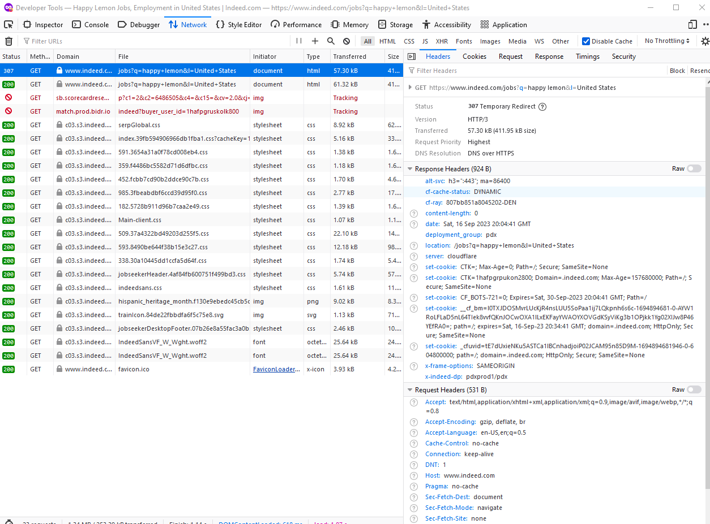

# Scraper

Some stuff for how the scraper will function 

## Bot Detection

Cloudflare test site: https://nowsecure.nl
(DONT VIST IN BROWSER YOULL HAVE A SEIZURE)

### Factors in bot detection:

- ### TLS Hanshake fingerprint
    
  TLS fingerprinting is a prevalent method for detecting bots. When a client initiates a connection, it sends a 'hello' message to the server, which includes details on configuring the TLS connection. Here's how the process works:

  **Creation of the Fingerprint:** Upon receiving the hello message, the server generates a hash fingerprint based on the client's configuration.

  **Comparison with Blocked Fingerprints:** The server compares this newly created fingerprint against a database of known, blocked fingerprints.

  **Response from the Server:**

  - If a match is found, the server may either challenge the client or block the connection outright.
  - If no match is found, the connection proceeds normally.

  To evade detection, one can attempt to generate a unique TLS hash by adjusting the order of the ciphers sent to the server. This can change the resulting fingerprint, potentially bypassing filters that rely on known blocked fingerprints. Note that the first three Ciphers in the list are standard and shouldnt be reordered for security reasons that I do not know.

  Example of the list of Ciphers sent by Node:

  ```
  TLS_AES_256_GCM_SHA384
  TLS_CHACHA20_POLY1305_SHA256
  TLS_AES_128_GCM_SHA256
  ECDHE-RSA-AES128-GCM-SHA256
  ECDHE-ECDSA-AES128-GCM-SHA256
  ECDHE-RSA-AES256-GCM-SHA384
  ECDHE-ECDSA-AES256-GCM-SHA384
  DHE-RSA-AES128-GCM-SHA256
  ECDHE-RSA-AES128-SHA256
  DHE-RSA-AES128-SHA256
  ECDHE-RSA-AES256-SHA384
  DHE-RSA-AES256-SHA384
  ECDHE-RSA-AES256-SHA256
  DHE-RSA-AES256-SHA256
  HIGH
  !aNULL
  !eNULL
  !EXPORT
  !DES
  !RC4
  !MD5
  !PSK
  !SRP
  !CAMELLIA 
  ```

  For a detailed guide on how to modify the default TLS cipher suite in a Node.js environment, please refer to the official Node.js documentation: Modifying the Default TLS Cipher Suite.


- ### HTTP2 Fingerprint
- ### Request headers 
- ### Javascript enabled


## Websites

The following are a list of the top job sites that will be scraped/crawled/queried for data. Terms of web crawling will be included. Here is a resource on Robots.txt properites to respect for web scraping

[Robot Exclusion Standard](https://www.robotstxt.org/orig.html)

### Linkedin

`Public API`: none <br />

To crawl linkedin, you must be whitelisted. Crawling is subject to [LinkedIn Crawling Terms and Conditions](https://www.linkedin.com/legal/crawling-terms).

### Indeed

`Public API`: [depricated](https://developer.indeed.com/docs/publisher-jobs/job-search) <br />

Indeed robots.txt allows scaping on the /jobs route. 🥳

#### Bot detection: 
  Indeed uses cloudflare to detect bots. It looks like if you do not have javascript enabled (IE you make a direct AJAX request) cloudflare gets susicious and redirects you to set a bunch of cookies 

  
### Monster

`Public API`: none <br />

robots.txt is not friendly. Could potentially scrape on https://www.monster.com/jobs/q-it-jobs

### Wellfound (AngelList)

Does not allow any web scraping. I somehow had my IP blocked by just visting their robots.txt as myself 


bunch of losers

### Glassdoor

### WeWorkRemotely

`Public API`: none <br />

offers an RSS feed of job listings

### Dice

`Public API`: none <br />

Robots.txt allows crawling on /jobs

## Strategy

Most of these websites use asynronous fetching. The listing details arnt loaded on the same page where the posting headlines are aggregated. We probably wont need to use an automated headless browser controller API. We can instead replicate the dynamic requests somehow using the initial HTML fetch `TODO: Figure out how to do this`.